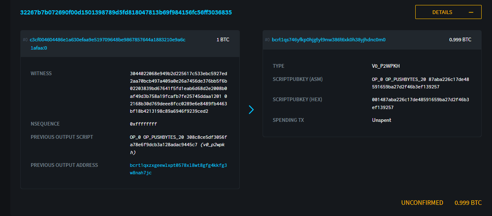

# bdsegwit - Segwit Example using Sepior/Blockdaemon

1. Generate test wallets using [bitBitcoin Test Wallets Generator](https://github.com/bitcoin-studio/Bitcoin-Test-Wallets-Generator) - `npx bitcointestwalletsgenerator --entropy 16`

If you are using bitcoin-cli via an alias to nigiri docker, the script run by npx might not have access to the alias. In that case you may need to execute the import script directly on the wallets.hjson file generated by the generator.

```bash
count=0
wallets=(alice_1 alice_2 alice_3 bob_1 bob_2 bob_3 carol_1 carol_2 carol_3 dave_1 dave_2 dave_3 eve_1 eve_2 eve_3 mallory_1 mallory_2 mallory_3)

cat wallets.json | jq -r '.[][] | (.wif // empty)' |
while read -r wif
do
    bitcoin-cli importprivkey ${wif} ${wallets[count]}
    ((count ++))
done
```

2. Generate Blocks

The regtest mode replicates the 100 block confirm to spend coinbase transactions, so in order to have funds in the core wallet you need to generate 101 blocks.

We can use generatetoaddress to generate blocks and specify the miner to receive the blockrewards. We can for example generate to Dave's native segwit address (see wallets.json for your generate address)


`bcli generatetoaddress 101 bcrt1qr7x0sr05gduh94s70nep6v4jflfehfpg6xk3ea`

3. Generate a key and get the address to fund - we'll spend from this address.

```
$ node genkey.js 
Generated key with key ID: T6ebdn3KJw31tXgG8JbpHBwVchO7
segwit address is bcrt1qxzxgeewlxpt0578xl8wt8gfg4kkfg3w8nah7jc
pkh is 308c8ce5df3056fa78e6f9dcb3a128adac9445c7
```

4. Send 1 BTC to our address to create a P2WPKH to spend

```
bcli sendtoaddress bcrt1qxzxgeewlxpt0578xl8wt8gfg4kkfg3w8nah7jc 1
a6526375731c7e2677f9a8b2b2122e1b5c316a823072eddd9c80364f50b0afbd
```

Note the transaction id. Get the output index

```
bcli gettransaction a6526375731c7e2677f9a8b2b2122e1b5c316a823072eddd9c80364f50b0afbd
{
  "amount": -1.00000000,
  "fee": -0.00000141,
  "confirmations": 0,
  "trusted": true,
  "txid": "a6526375731c7e2677f9a8b2b2122e1b5c316a823072eddd9c80364f50b0afbd",
  "walletconflicts": [
  ],
  "time": 1694723300,
  "timereceived": 1694723300,
  "bip125-replaceable": "no",
  "details": [
    {
      "address": "bcrt1qxzxgeewlxpt0578xl8wt8gfg4kkfg3w8nah7jc",
      "category": "send",
      "amount": -1.00000000,
      "vout": 0,
      "fee": -0.00000141,
      "abandoned": false
    }
  ],
  "hex": "020000000001010f0a42683826f783e2521af68fed350cec407ac87b766c3f9b31dfedcb310a100000000000feffffff0200e1f50500000000160014308c8ce5df3056fa78e6f9dcb3a128adac9445c75411102401000000160014dfb647200b2caf95ef9dbd3db543d35263704aa80247304402202adfaedd850ba06118d7875253e5ec3976d71a6e1dcc4af53b86630610a705f402207fec3b642f7ee3c0d9ee35f94765b3c3a6586a76480d540d70da8b584b6345940121039f09973429e2b5608416bec3032a77ada9ffc968ca38c8cdb093d40cdffbc6098b000000"
}
```

Out index is vout. and we'll need the hex value for later.

4. Exit simple.js to update VOUT, and TX_ID, key id, and public key hash with the values from the previous step. Then run simple.js.

```
$ node simple.js 
do presigning
presigIDs: [
  '709STqZ5Jhnf5mQu4QQZq6000000',
  '709STqZ5Jhnf5mQu4QQZq6000001',
  '709STqZ5Jhnf5mQu4QQZq6000002',
  '709STqZ5Jhnf5mQu4QQZq6000003',
  '709STqZ5Jhnf5mQu4QQZq6000004'
]
Signature: 3044022068e949b2d225617c533ebc5927ed2aa70bcb497a409a0e26a7456de376bb5f6b02203839bd67641f5fd1eab6d68d2e2008b0af49d3b758a19fcafb7fe25745ddaa12
validator check status: true
Transaction hexadecimal:
02000000000101aaafc1a6e9103288a14476856798be48967019e5a9fa0e631a6e48044600cfc30000000000ffffffff01605af4050000000016001487aba226c17de48591659ba27d2f46b3ef13925702473044022068e949b2d225617c533ebc5927ed2aa70bcb497a409a0e26a7456de376bb5f6b02203839bd67641f5fd1eab6d68d2e2008b0af49d3b758a19fcafb7fe25745ddaa12012102168b30d769deee8fcc0289e6e8489fb4463bf18b4213198c89a6946f9239ced200000000
```

5. Send the transaction

```
$ bcli sendrawtransaction 02000000000101aaafc1a6e9103288a14476856798be48967019e5a9fa0e631a6e48044600cfc30000000000ffffffff01605af4050000000016001487aba226c17de48591659ba27d2f46b3ef13925702473044022068e949b2d225617c533ebc5927ed2aa70bcb497a409a0e26a7456de376bb5f6b02203839bd67641f5fd1eab6d68d2e2008b0af49d3b758a19fcafb7fe25745ddaa12012102168b30d769deee8fcc0289e6e8489fb4463bf18b4213198c89a6946f9239ced200000000

32267b7b072690f00d1501398789d5fd818047813b69f984156fc56ff3036835
```

View the details of the transaction

``` 
$ $ bcli decoderawtransaction 02000000000101aaafc1a6e9103288a14476856798be48967019e5a9fa0e631a6e48044600cfc30000000000ffffffff01605af4050000000016001487aba226c17de48591659ba27d2f46b3ef13925702473044022068e949b2d225617c533ebc5927ed2aa70bcb497a409a0e26a7456de376bb5f6b02203839bd67641f5fd1eab6d68d2e2008b0af49d3b758a19fcafb7fe25745ddaa12012102168b30d769deee8fcc0289e6e8489fb4463bf18b4213198c89a6946f9239ced200000000
{
  "txid": "32267b7b072690f00d1501398789d5fd818047813b69f984156fc56ff3036835",
  "hash": "c9ff9b87905abc453d7f56751c71c1cc339ba1c04b25768252415765bf262a8b",
  "version": 2,
  "size": 191,
  "vsize": 110,
  "weight": 437,
  "locktime": 0,
  "vin": [
    {
      "txid": "c3cf004604486e1a630efaa9e519709648be9867857644a1883210e9a6c1afaa",
      "vout": 0,
      "scriptSig": {
        "asm": "",
        "hex": ""
      },
      "txinwitness": [
        "3044022068e949b2d225617c533ebc5927ed2aa70bcb497a409a0e26a7456de376bb5f6b02203839bd67641f5fd1eab6d68d2e2008b0af49d3b758a19fcafb7fe25745ddaa1201",
        "02168b30d769deee8fcc0289e6e8489fb4463bf18b4213198c89a6946f9239ced2"
      ],
      "sequence": 4294967295
    }
  ],
  "vout": [
    {
      "value": 0.99900000,
      "n": 0,
      "scriptPubKey": {
        "asm": "0 87aba226c17de48591659ba27d2f46b3ef139257",
        "desc": "addr(bcrt1qs746yfkp0hjgtyt9nw386t6xk0h38yjhdnc0m0)#jxvmaeng",
        "hex": "001487aba226c17de48591659ba27d2f46b3ef139257",
        "address": "bcrt1qs746yfkp0hjgtyt9nw386t6xk0h38yjhdnc0m0",
        "type": "witness_v0_keyhash"
      }
    }
  ]
}
```




